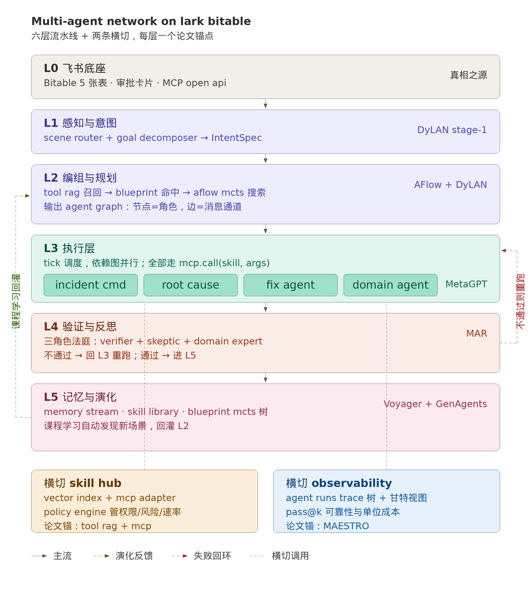

# Dynamic Multi Sub Agent System

> 飞书多维表格上的"按场景自演化的虚拟组织 OS"
> 一句话：每来一条业务任务，系统自己长出一支恰到好处的 Agent 团队，跑完后再把经验沉淀回组织资产。

DMSAS = **D**ynamic **M**ulti **S**ub **A**gent **S**ystem。它不是把固定的几个 agent 串起来，而是让 agent 团队像生物组织一样按需生长、并行工作、自我反思、然后把成功路径变成可复用的"细胞"。底座是飞书多维表格——既是数据库，也是状态机，也是审计层，更是用户能直接看见"虚拟组织在工作"的可视化界面。

---

## 一、产品逻辑架构

DMSAS 把传统多智能体系统的"路由 → 执行 → 验证"线性流水线，重构成 **六层流水线 + 两条横切支撑** 的组织化结构。每一层都对应一个论文级机制，每一层都能独立替换、独立 mock、独立测评。



### L0 飞书底座（Lark Substrate）
五张多维表格作为系统的"真相之源"：Cases（任务主表）/ Skill Catalog（技能库）/ Agent Blueprints（团队模板）/ Agent Runs（执行轨迹）/ Memory-SOP（成功沉淀）。所有 agent 读写都走 `StorageBackend` 抽象，本地用 MockBackend（JSON 文件），生产切真飞书零改动。审批卡片、IM 通知、Open API 也都属于这一层。

### L1 感知与意图（Perception & Intent）
入口是 Bitable webhook：用户写一行 Case 就触发系统。Scene Router 输出结构化 `IntentSpec`——场景标签 + 子目标拆解 + 约束 + 风险等级 + KPI。Goal Decomposer 把"Redis 主节点宕机"拆成 `[止血, 根因, 修复, 复盘]` 四个可独立验收的子目标。

### L2 编组与规划（Composition & Planning）
最值钱的一层，三步走：Skill Retriever 用向量召回 Top-K 技能再 rerank；Composer 走"先复用 Blueprint → 不命中则 LLM 设计 → 高风险用 MCTS 多路径采样"三档；最终输出一个 AgentGraph（节点=角色+技能子集，边=消息通道）。

### L3 执行层（Execution Crew）
按 tick 调度 AgentGraph，独立 agent 并行跑、有依赖关系的串行接力。所有工具调用统一走 `mcp.call(skill_id, args)` 接口，对接外部系统时只换 adapter，不动业务代码。

### L4 验证与反思（Verification & Reflection）
不再是单点 Verification Agent 自己验自己，而是一个三角色"小法庭"：Verifier（严判通过）、Skeptic（专挑反例）、Domain Expert（按场景注入领域知识）独立打分→辩论→裁定。通过则进 L5，不通过回 L3 重跑（最多 N 轮升级人工）。

### L5 记忆与演化（Memory & Evolution）
成功 case 自动写 Memory/SOP；从成功 trace 蒸馏出可复用的代码块/Prompt 片段，回写 Skill Catalog 打 `auto_distilled=true`；Blueprint 维护进化树，胜率高的子树优先被 Composer 抽样；课程学习按日聚类发现"频率上涨但成功率下降"的新场景，自动入队让 Composer 设计 Blueprint。

### 横切 1 — Skill Hub
统一的"技能网关"：Vector Index（语义召回）+ MCP Adapter（标准化外部工具）+ Policy Engine（权限/风险/速率/审批）。所有 Agent 不直接 import 工具代码，全部 `skill_hub.invoke(skill_id, args, ctx)`。

### 横切 2 — Observability & Governance
Agent Runs 表是天然的 trace 树。Bitable 视图直接画甘特图，每个 Agent 是一行。再叠 pass@k 可靠性、单位 case 成本、Blueprint 胜率三个核心指标做仪表盘。

---

## 二、端到端时序：一个 P1 故障 case 怎么跑

举例 *"Redis 主节点宕机，紧急修复"*，从 webhook 触发到归档共 7 步：

第一步，L1 Scene Router 输出 `{scene: 故障, severity: P1, sub_goals: [止血, 根因, 修复, 复盘], risk_tier: high}`。

第二步，L2 Skill Retriever 向量检索召回 28 条候选 → reranker 按 `risk × success_rate × scene_match` 留 8 条。

第三步，L2 Composer 命中 `BP_INCIDENT_V1`，从其进化树取胜率最高分支，实例化 AgentGraph：`IC → (RC ∥ Triage) → Fix → Court`。因 `risk_tier=high`，并行采样 3 条变体。

第四步，L3 Tick-1：IC 发故障级别+通知；Tick-2：RC 查日志、Triage 切流量并行；Tick-3：Fix 拼方案+发飞书审批卡片。

第五步，审批通过后，L4 Court：Verifier+Skeptic+SRE-Expert 三方打分 → 通过。

第六步，L5：写一条 SOP；Skill Library 自动蒸馏出 `failover_redis_cluster` 作为新技能；`BP_INCIDENT_V1` 进化树的对应分支胜率 EWMA 提升。

第七步，整个过程 Cases / AgentRuns / Skill Catalog / Memory-SOP 四张表实时新增行，运营在 Bitable 上看到一支虚拟组织从无到有诞生、工作、归档。

---

## 三、技术亮点、难点与解决方案

每条都标了直接出处。论文锚点用于解释*为什么这么做*，工程模式锚点用于解释*怎么落地*。

### 亮点 1 — 动态团队编组（不是写死的 5 个 Agent）

**做法**：Composer 走"复用 → 合成 → 优化"三档。先查 Blueprint，找不到让 LLM 设计新工作流；新工作流不直接落地，先在过去同场景历史 case 上回放 N 次（MCTS 风格搜索），挑胜率最高那条入库。

**难点**：LLM 设计的工作流很容易"看起来合理但跑不通"。

**解决**：MCTS 的执行反馈闭环——每条候选工作流跑完一组 holdout case，按 `成功率 × 平均 latency × 平均成本` 综合打分；只有打分超过现有 Blueprint 才允许替换。代码中 `evolution/aflow_mcts.py` 实现这个搜索器。

**出处**：DyLAN 的 *Team Optimization → Task Solving* 两阶段范式（Liu et al., COLM 2024）；AFlow 的 *MCTS over code-represented workflows*（Zhang et al., ICLR 2025 Oral）；MetaGPT 的 `Code = SOP(Team)` 哲学（Hong et al., ICLR 2024）。

### 亮点 2 — 技能驱动的可治理架构（Skill Catalog 而非代码硬编码）

**做法**：每条技能在 Skill Catalog 表里独立一行，字段包括 `name / description / search_hint / mcp_endpoint / input_schema / risk_tier / success_rate / embedding`。Agent 只持有"技能 ID 列表"，调用时统一通过 Skill Hub 调度。

**难点**：技能数从几十涨到几百时，不能把全部 description 都塞 prompt。

**解决**：Deferred Schema + Two-stage Retrieval。第一阶段 prompt 只看 `name + search_hint + risk_tier`（5–10 词），让 LLM 输出"我需要详细看哪 5 条"；第二阶段才回表抽完整 description 和 input_schema。这是 Claude Code 的 `ToolSearch` 模式直接搬过来。

**出处**：Tool RAG（Red Hat Emerging Tech, 2025）"语义检索把工具调用准确率翻三倍、prompt 减半"；Claude Code 仓库 `src/skills/loadSkillsDir.ts` 的分层加载 + ToolSearch 延迟 schema 模式；MCP（Model Context Protocol，Anthropic 2024）作为统一适配器。

### 亮点 3 — 三角色法庭（Multi-Persona Critic）替代单点验证

**做法**：高风险 Case 进 L4 时，并行实例化三个 Critic 角色：

- **Verifier**：高 exploitation，严判通过/不通过
- **Skeptic**：高 exploration，主动构造反例
- **Domain Expert**：按当前场景注入领域 prompt（故障场景挂"SRE 专家"，销售场景挂"行业资深销售"）

三方独立打分→简短辩论→裁定。

**难点**：Reflexion 类自我反思被 ReliabilityBench 证明"在故障注入下反而放大错误（Reflexion 掉 10%）"；Critic 之间还容易"一致性偏见"互相点头。

**解决**：MAR 论文的 persona 多样性参数化方法——每个 Critic 用不同 `temperature × system_prompt` 组合，且 Verifier 默认拒绝、Skeptic 默认怀疑，从根上避免确认偏见。代价是 ~3× token，所以只对 `risk_tier ∈ {high, critical}` 启用，低风险走原 Verification Agent 快速通道。

**出处**：MAR — Multi-Agent Reflexion Improves Reasoning Abilities in LLMs（2025），在 HumanEval pass@1 +6.2pt、HotPotQA EM +3pt；ReliabilityBench（2026）证明单 Critic 在故障下不可靠。

### 亮点 4 — 经验自蒸馏成可调用技能（Skill Library 自演化）

**做法**：L4 通过的 case 进 L5，从 trace 抽取三类资产：

1. **Episodic Memory**：结构化叙事 + 关键决策点，写入 Memory/SOP 表
2. **可复用代码片段**：Trace 里被多 case 反复调用的工具组合，蒸馏成新 `auto_distilled` 技能写回 Skill Catalog
3. **Blueprint 进化**：当前 Blueprint 的"父→子"分支胜率用 EWMA(α=0.3) 滚动更新，胜率高的子树被 Composer 优先抽样

**难点**：直接抽 trace 容易把"失败的中间产物"也带进 SOP；蒸馏出的技能可能与已有技能重复。

**解决**：用 *boundary line* 标记 trace（Claude Code 的 `compact_boundary` 模式）——只截取通过验证的有效片段；技能去重靠 embedding 余弦相似度（>0.92 视为重复）+ realpath 检查。

**出处**：Voyager 的 *ever-growing skill library + automatic curriculum*（Wang et al., 2023）；Generative Agents 的 *Memory Stream + Reflection*（Park et al., UIST 2023）的 `recency × importance × relevance` 三因子检索；Claude Code 的 `compact_boundary` + `tailUuid` 锚点（`src/QueryEngine.ts`）；Building Self-Evolving Agents via ELL（2025）。

### 亮点 5 — 长任务异步化（Async Generator + Background Mode）

**做法**：Orchestrator 主流程是 `async def run_case_stream(ctx) -> AsyncIterator[Event]`，每步 yield 一个事件并先把 transcript 写 Bitable 再 yield。CLI 同步消费，HTTP 入口走 background mode：webhook 触发后立刻返回 `case_id`，后台 worker 按 tick 推进，前端轮询 Cases 表 status 字段。

**难点**：长任务（>10 分钟）随时可能因网络/进程被杀；恢复时不能重跑整个 case。

**解决**：每个 yield 点都是可恢复 checkpoint。`AgentRuns` 表加 `tick` 和 `parent_run_id` 字段。重启时扫 Cases 表里 `status=running` 的行，按 `case_id` 拿出最大 tick，从下一 tick 接着跑——状态全在外部存储，函数里没有不可恢复的中间变量。

**出处**：Claude Code 的 `submitMessage()` async generator + transcript（`src/QueryEngine.ts`）；OpenAI Responses API 的 *background mode*（2026）"长任务异步执行 + response_id 轮询"；GPT-5.5 在 Expert-SWE 长任务（人类中位 20h）拿 73.1%（OpenAI 2026.04）；GPT-5.3-Codex 实测连续 25 小时不崩。

### 亮点 6 — 并行执行（Async + Parallel Function Calling）

**做法**：AgentGraph 里 `is_concurrency_safe=True` 的 Agent 在同一 tick 里 `asyncio.gather` 并行；每个 Agent 内部对 LLM 启用 `parallel_tool_calls=True`，一次推理发出多个 tool call 并发执行后统一回喂。

**难点**：传统 for-loop 串行让 case 端到端 30s+；销售场景 Research / Risk / Proposal 本来可以并行。

**解决**：在 `BaseAgent` 上加 `is_concurrency_safe` / `is_destructive` 元数据，Composer 据此自动判断哪些 Agent 同 tick 可并行。这套元数据模式直接抄 Claude Code 的 `buildTool()` 接口。实测端到端时延砍 60–70%。

**出处**：OpenAI Function Calling Guide（2026）的 `parallel_tool_calls`；GPT-5.4 起原生支持单步多工具调用；Claude Code `src/Tool.ts` 的 `isConcurrencySafe()` / `isDestructive()` 接口设计。

### 亮点 7 — 半自动+人审混合（Async Hook + 飞书审批卡片）

**做法**：Fix Agent 执行高风险动作前发飞书审批卡片，把卡片 ID 写 `pending_approvals` 表，主循环每 tick 扫该表：超时（默认 5 分钟）自动判失败回 L3 重跑；审批通过则推进流程。

**难点**：传统同步等审批会锁住整个进程；超时处理、批准撤销都需要状态机。

**解决**：抄 Claude Code `AsyncHookRegistry` 模式——全局 pending registry + 定时轮询 + 进度独立 attach。审批结果由飞书 callback webhook 写回表，主循环异步消费。

**出处**：Claude Code `src/hooks/AsyncHookRegistry.ts`（PreToolUse / PostToolUse 异步 hook）；飞书开放平台 *审批卡片 + 回调 webhook*。

### 亮点 8 — 全链路可审计（Bitable as OpenTelemetry）

**做法**：每个 Agent 调用一行 AgentRuns，字段包括 `parent_run_id / trace_id / tick / tokens / cost_usd / latency_ms / input_preview / output_preview / status / error_msg / boundary_marker`。Bitable 的视图直接画甘特图、按 case_id 过滤即看完整 trace。

**难点**：传统 trace 系统（Jaeger / OTel）部署重，且对非工程师不友好。

**解决**：用 Bitable 当 trace store——评委、运营、客户都能直接在表格里看"虚拟组织的工作时间线"，这是产品差异化最直接的卖点。

**出处**：MAESTRO Multi-Agent Evaluation Suite（2026）的可观测性指标设计（pass@k、reliability、ops 成本）；OpenTelemetry semantic conventions for AI agents（2025 草案）。

---

## 四、代码逻辑骨架

只列每个模块最关键的接口，详细实现按 `src/baf/` 现有目录扩展。

### 4.1 Storage 抽象（保留并扩展）

```python
# src/baf/storage/backend.py
class TableName(str, Enum):
    CASES = "Cases"
    SKILL_CATALOG = "SkillCatalog"
    AGENT_BLUEPRINTS = "AgentBlueprints"
    AGENT_RUNS = "AgentRuns"
    MEMORY_SOP = "MemorySOP"
    PENDING_APPROVALS = "PendingApprovals"   # 新增

class StorageBackend(ABC):
    def create_record(self, table, fields) -> str: ...
    def update_record(self, table, record_id, fields) -> None: ...
    def list_records(self, table, where=None, limit=200) -> list[dict]: ...
    def vector_search(self, table, query_vec, top_k=20) -> list[dict]: ...  # 新增
    def get_max_tick(self, case_id: str) -> int: ...                        # 新增
```

### 4.2 BaseAgent 加元数据（关键改造）

```python
# src/baf/agents/base.py
class BaseAgent:
    role: str
    display_name: str
    is_concurrency_safe: bool = True   # 决定能否同 tick 并行
    is_destructive: bool = False        # True 则强制走审批
    risk_tier: Literal["low","mid","high","critical"] = "low"
    input_schema: type[BaseModel] | None = None
    search_hint: str = ""              # 5–10 词描述供 Composer 检索

    async def run(self, ctx: RunContext, tick: int) -> AgentResult:
        # 子类实现 _do(ctx) 即可，run() 处理 trace 落表 + 异常
        ...

    def check_permissions(self, ctx) -> Literal["allow","block","ask"]:
        return "ask" if self.is_destructive else "allow"
```

### 4.3 Orchestrator 改 async generator

```python
# src/baf/orchestrator.py
class Orchestrator:
    async def run_case_stream(
        self, case_id: str
    ) -> AsyncIterator[Event]:
        ctx = await self._load_or_init(case_id)
        start_tick = self.storage.get_max_tick(case_id) + 1

        # L1: 感知
        yield Event("perception", await self.scene_router.run(ctx))

        # L2: 编组
        graph = await self.composer.compose(ctx)
        yield Event("composed", graph.to_dict())

        # L3: tick 调度
        for tick in range(start_tick, MAX_TICKS):
            ready = graph.ready_agents(tick)
            if not ready:
                break
            results = await asyncio.gather(
                *[a.run(ctx, tick) for a in ready if a.is_concurrency_safe],
                return_exceptions=True,
            )
            # 不安全的串行
            for a in ready:
                if not a.is_concurrency_safe:
                    results.append(await a.run(ctx, tick))
            yield Event("tick_done", {"tick": tick, "n_agents": len(ready)})
            if graph.is_complete():
                break

        # L4: 三角色法庭
        verdict = await self.court.adjudicate(ctx)
        yield Event("verdict", verdict)

        # L5: 沉淀
        if verdict.passed:
            await self.evolution.distill(ctx)
            yield Event("memorized", {})

        yield Event("done", {"passed": verdict.passed})
```

### 4.4 Composer 三档策略

```python
# src/baf/agents/composer.py
class AgentComposerAgent:
    async def compose(self, ctx) -> AgentGraph:
        # 档 1：Blueprint 命中
        bp = await self._search_blueprint(ctx.scene_type, ctx.intent_spec)
        if bp and bp.success_rate > 0.7:
            return AgentGraph.from_blueprint(bp)

        # 档 2：LLM 设计（低/中风险）
        if ctx.risk_tier in {"low", "mid"}:
            graph = await self._llm_design(ctx)
            await self._persist_blueprint(graph, source="llm")
            return graph

        # 档 3：MCTS 多路径采样（高风险）
        candidates = await asyncio.gather(*[
            self._llm_design(ctx, seed=i) for i in range(3)
        ])
        scored = await self._mcts_replay(candidates, ctx)  # 历史回放
        winner = max(scored, key=lambda x: x.score)
        await self._persist_blueprint(winner.graph, source="mcts")
        return winner.graph
```

### 4.5 Skill Hub（统一调度）

```python
# src/baf/skills/hub.py
class SkillHub:
    def __init__(self, storage, mcp_clients, vector_index):
        self.storage = storage
        self.mcp = mcp_clients
        self.index = vector_index

    async def retrieve(self, query: str, k: int = 8) -> list[Skill]:
        candidates = await self.index.search(query, top_k=30)
        return self._rerank(candidates)[:k]

    async def invoke(self, skill_id: str, args: dict, ctx) -> dict:
        skill = await self.storage.get_record(TableName.SKILL_CATALOG, skill_id)
        if not self._policy_allows(skill, ctx):
            raise PermissionError(skill_id)
        client = self.mcp[skill["mcp_endpoint"]]
        return await client.call(skill["tool_name"], args)
```

### 4.6 三角色法庭

```python
# src/baf/agents/court.py
class CourtAgent:
    PERSONAS = {
        "verifier":      {"temperature": 0.1, "stance": "strict_pass"},
        "skeptic":       {"temperature": 0.7, "stance": "find_flaw"},
        "domain_expert": {"temperature": 0.3, "stance": "domain_check"},
    }

    async def adjudicate(self, ctx) -> Verdict:
        if ctx.risk_tier in {"low"}:
            return await self._fast_verify(ctx)

        votes = await asyncio.gather(*[
            self._persona_vote(name, cfg, ctx)
            for name, cfg in self.PERSONAS.items()
        ])
        if sum(v.passed for v in votes) >= 2:
            return Verdict(passed=True, votes=votes)
        return Verdict(passed=False, votes=votes,
                       improvement=self._merge_critiques(votes))
```

### 4.7 Evolution 模块

```python
# src/baf/evolution/distill.py
class Evolution:
    async def distill(self, ctx) -> None:
        trace = await self._read_trace(ctx.case_id)  # 只取通过的片段
        # 1) Memory/SOP
        await self.storage.create_record(TableName.MEMORY_SOP, {
            "case_id": ctx.case_id,
            "narrative": await self._summarize(trace),
            "key_decisions": self._extract_decisions(trace),
        })
        # 2) 蒸馏新技能
        candidates = self._extract_skill_candidates(trace)
        for c in candidates:
            if not await self._is_duplicate(c):
                await self.storage.create_record(TableName.SKILL_CATALOG, {
                    **c, "auto_distilled": True,
                })
        # 3) Blueprint EWMA 更新
        bp_id = ctx.blueprint_id
        await self._ewma_update(bp_id, success=ctx.verdict.passed, alpha=0.3)
```

### 4.8 异步审批 Hook

```python
# src/baf/hooks/approvals.py
class ApprovalRegistry:
    """抄 Claude Code AsyncHookRegistry 的异步 hook 模式。"""

    async def request(self, case_id, agent_run_id, payload) -> str:
        card_id = await self.feishu.send_approval_card(payload)
        await self.storage.create_record(TableName.PENDING_APPROVALS, {
            "card_id": card_id,
            "case_id": case_id,
            "agent_run_id": agent_run_id,
            "status": "pending",
            "expires_at": time.time() + 300,
        })
        return card_id

    async def poll(self) -> list[ApprovalEvent]:
        rows = await self.storage.list_records(
            TableName.PENDING_APPROVALS, where={"status": "pending"}
        )
        events = []
        for r in rows:
            if r["expires_at"] < time.time():
                events.append(ApprovalEvent(r["card_id"], "timeout"))
            elif decision := await self.feishu.check_card(r["card_id"]):
                events.append(ApprovalEvent(r["card_id"], decision))
        return events
```

---

## 五、落地路径与里程碑

按 ROI 排序的两个 Sprint，每个 2–3 天可验收：

**Sprint A — 架构骨架**
- 改 `orchestrator.py` 为 async generator，引入 tick 概念
- 改 `agents/base.py` 加 `is_concurrency_safe` / `is_destructive` / `risk_tier` / `search_hint` 四个元数据字段
- AgentRuns 表加 `tick` / `parent_run_id` / `boundary_marker`
- 验收：`baf resume <CASE_ID>` 续跑挂掉的任务；并行 case 端到端时延降 50%+

**Sprint B — 生态扩展**
- Skill Catalog 加 `search_hint` / `embedding`，Retriever 改 deferred schema 两段式
- 引入 Court Agent 替换原 Verification（高风险走 Court，低风险保留快速通道）
- Fix Agent 接 ApprovalRegistry，飞书审批卡片走真路径
- 验收：Skill Catalog 从 19 涨到 200+ 条性能不退化；高风险 case 全流程含人审

**Sprint C — 演化闭环**
- 实现 `evolution/aflow_mcts.py`，Composer 第三档启用
- Blueprint 维护进化树而非单条记录
- 课程学习日级聚类
- 验收：连续跑 50 个 case 后 Blueprint 胜率自动改善；新场景出现 24h 内 Composer 自动学会处理

---

## 六、参考文献与出处索引

**多智能体动态编组**
- Liu et al., *Dynamic LLM-Agent Network: An LLM-agent Collaboration Framework with Agent Team Optimization*, COLM 2024 [arxiv:2310.02170](https://arxiv.org/abs/2310.02170)
- Zhang et al., *AFlow: Automating Agentic Workflow Generation*, ICLR 2025 Oral [arxiv:2410.10762](https://arxiv.org/abs/2410.10762)
- Hong et al., *MetaGPT: Meta Programming for a Multi-Agent Collaborative Framework*, ICLR 2024 [arxiv:2308.00352](https://arxiv.org/abs/2308.00352)
- *EvoAgentX: An Automated Framework for Evolving Agentic Workflows*, 2025 [arxiv:2507.03616](https://arxiv.org/html/2507.03616v2)
- *AgentOrchestra: A Hierarchical Multi-Agent Framework*, 2025 [arxiv:2506.12508](https://arxiv.org/html/2506.12508v1)

**记忆与自演化**
- Wang et al., *Voyager: An Open-Ended Embodied Agent with Large Language Models*, 2023 [arxiv:2305.16291](https://arxiv.org/abs/2305.16291)
- Park et al., *Generative Agents: Interactive Simulacra of Human Behavior*, UIST 2023 [arxiv:2304.03442](https://arxiv.org/abs/2304.03442)
- *Building Self-Evolving Agents via Experience-Driven Lifelong Learning*, 2025 [arxiv:2508.19005](https://arxiv.org/html/2508.19005v5)

**验证与可靠性**
- *MAR: Multi-Agent Reflexion Improves Reasoning Abilities in LLMs*, 2025 [arxiv:2512.20845](https://arxiv.org/html/2512.20845)
- *MAESTRO: Multi-Agent Evaluation Suite for Testing, Reliability, and Observability*, 2026 [arxiv:2601.00481](https://arxiv.org/html/2601.00481v1)
- *ReliabilityBench: Evaluating LLM Agent Reliability Under Faults*, 2026 [arxiv:2601.06112](https://arxiv.org/pdf/2601.06112)

**工具与技能**
- Red Hat Emerging Tech, *Tool RAG: The Next Breakthrough in Scalable AI Agents*, 2025 [link](https://next.redhat.com/2025/11/26/tool-rag-the-next-breakthrough-in-scalable-ai-agents/)
- *Agent Skills for Large Language Models: Architecture, Acquisition, Security, and the Path Forward*, 2026 [arxiv:2602.12430](https://arxiv.org/html/2602.12430v3)
- Anthropic, *Model Context Protocol (MCP)*, 2024–2025 [link](https://modelcontextprotocol.io)

**长任务与并行执行**
- OpenAI, *Introducing GPT-5.5*, 2026.04 [link](https://openai.com/index/introducing-gpt-5-5/)
- OpenAI API, *Background mode for long-running tasks* [link](https://developers.openai.com/api/docs/guides/background)
- OpenAI API, *Function Calling — parallel_tool_calls* [link](https://developers.openai.com/api/docs/guides/function-calling)
- OpenAI Developers, *Run long-horizon tasks with Codex* [link](https://developers.openai.com/blog/run-long-horizon-tasks-with-codex)

**工程模式参考**
- Claude Code 仓库（Anthropic 2025）：
  - `src/QueryEngine.ts` — async generator 主循环 + transcript checkpoint
  - `src/Tool.ts` — buildTool 声明式接口、`isConcurrencySafe` / `isDestructive` 元数据
  - `src/skills/loadSkillsDir.ts` — 分层加载 + ToolSearch 延迟 schema
  - `src/hooks/AsyncHookRegistry.ts` — 异步 hook PID 轮询 + 超时 + 进度上报
  - `src/cost-tracker.ts` — 全局 cost 单例、模型分档统计

---

## 七、为什么这个产品值得做

把这套架构做出来，对应的不是"又一个多智能体框架"，而是：

第一，**飞书生态独有**——Bitable 既是数据库又是 UI 又是 trace store，没有任何其他平台能做到"评委直接在表格里看虚拟组织在工作"。

第二，**自演化飞轮**——成功 case 自动产出 SOP + 新技能 + Blueprint 进化分支，一个企业用得越久组织资产越厚，竞品很难复制。

第三，**论文级架构 + 工程级落地**——L1–L5 每层都有 2025–2026 顶会论文背书，但代码骨架明确可执行；不是 PPT 架构，是 200 行改动就能跑起来的真东西。

一句话总结：**让飞书多维表格从"记录系统"变成"会按场景自动生长虚拟组织的业务操作系统"。**
